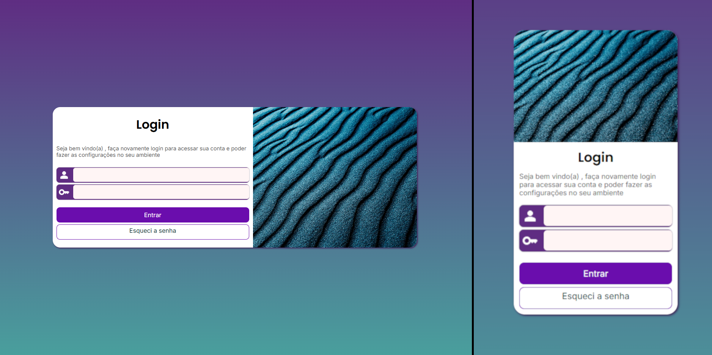

# Login Page / Página de Login

🇧🇷 **Descrição (Português):**  
Este projeto foi criado para praticar os conceitos de CSS Grid Layout aprendidos. A página apresenta uma estrutura simples de login, com foco na organização visual e responsividade do conteúdo.

---

🇬🇧 **Description (English):**  
This project was created to practice the CSS Grid Layout concepts I learned. The page features a simple login structure, focusing on visual organization and content responsiveness.

---

## Objetivos do projeto / Project Objectives

🇧🇷 **O que aprendi / Praticado:**  
- Responsividade do conteúdo  
- Alteração do posicionamento da imagem usando Grid  

🇬🇧 **What I learned / Practiced:**  
- Making the content responsive  
- Adjusting the image positioning using Grid  

---

## Captura de tela / Screenshot

📁 **Projeto / Project:**  
[Visualizar o projeto / View Project](https://alvarenga-io.github.io/login-responsivo)

---

## Próximos passos / Next Steps

🇧🇷 Melhorar a responsividade para diferentes tamanhos de tela e adicionar validação de formulário.  

🇬🇧 Improve responsiveness for different screen sizes and add form validation.
