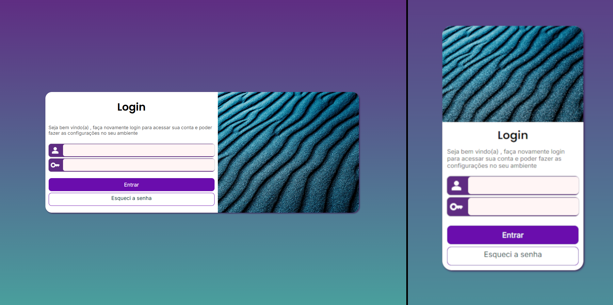

# Página de Login

Projeto foi desenvolvido com o objetivo da por em prática os conceitos aprendidos de Grid Layout.

## O que aprendi:

Responsividade do conteúdo.
Alterar o posicionamento da imagem por meio do Grid.

## Preview

📁 Acesse o projeto clicando [aqui](https://alvarenga-io.github.io/login-responsivo).
